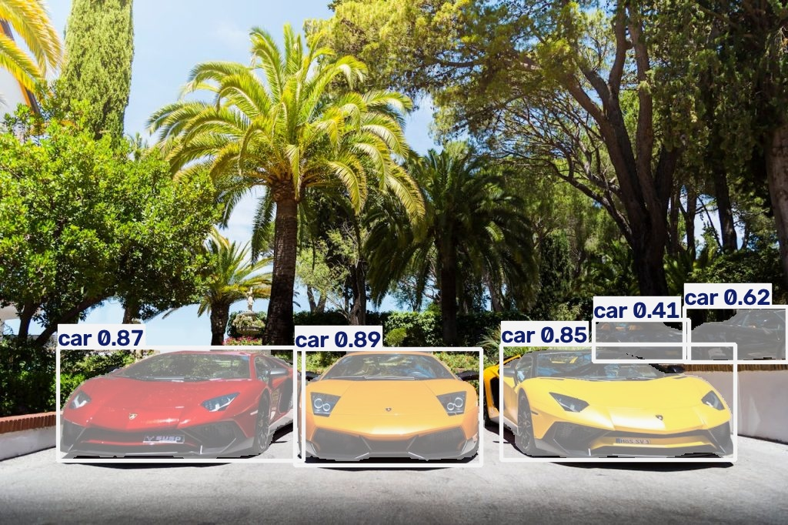
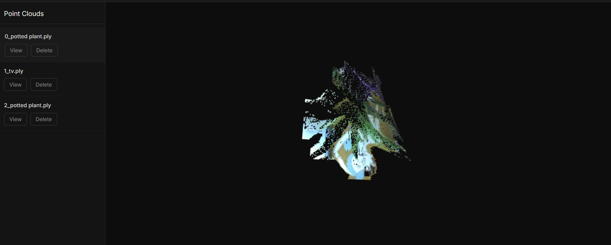

# VisionLab

A modular computer vision platform built with Flask. Upload an image, pick a model, and get AI-powered results — segmentation, detection, or a 3D point cloud you can explore right in the browser.

**Live demo:** [http://4.213.227.190](http://4.213.227.190) — try it without signing up; sign up afterward to save your result.




---

## Features

- **Image Segmentation** — YOLO (instance) and DeepLabV3 (semantic)
- **Object Detection** — YOLO bounding-box detection
- **3D Reconstruction** — RGB-D image pair → point cloud, viewable and orbitable in-browser via Three.js
- **Try before you sign up** — run any feature anonymously; the result is saved to your account automatically if you sign up or log in right after
- **Per-user result history** — filterable by task, with deletion of associated files

---

## Tech Stack

**Backend:** Flask, Flask-SQLAlchemy, Flask-Login, Flask-WTF, Flask-Migrate
**ML/CV:** PyTorch (CPU-only), Ultralytics YOLO, DeepLabV3, OpenCV, Open3D
**Database:** SQLite
**Frontend:** HTML, CSS, vanilla JS, Three.js
**Deployment:** Azure VM (Ubuntu), Gunicorn, Nginx, systemd

---

## Architecture

```
Browser → Nginx (port 80, serves /static/ directly)
        → Gunicorn (3 workers, --preload for shared model memory)
        → Flask app (segapp.py)
              ├── Model registry (services/)
              ├── SQLAlchemy models — User, IVPlatform
              └── SQLite (test.db)
```

Model weights load once in the Gunicorn master process and are shared read-only across workers via `--preload`, keeping memory roughly flat as worker count increases.

---

## Local Setup

```bash
git clone https://github.com/poluridushyanthreddy/VisionLab.git
cd VisionLab

python3 -m venv venv
source venv/bin/activate          # Windows: venv\Scripts\activate
pip install -r requirements.txt

export SECRET_KEY=$(python -c "import secrets; print(secrets.token_hex(32))")
export FLASK_APP=segapp.py
flask db upgrade

python segapp.py
```
Visit `http://localhost:5000`.

---

## Security

- All delete/view routes verify resource ownership (`user_id` vs `current_user.id`) before acting
- File deletion validates resolved paths stay within the intended directory
- Uploads are renamed with a random UUID prefix; original filenames are never trusted directly
- CSRF protection enabled globally via Flask-WTF
- Anonymous uploads are never persisted to the DB — only claimed into a real row if the user signs up/logs in right after; unclaimed files are cleaned up automatically

---

## Maintenance

**Orphaned file cleanup** runs hourly via cron, removing anonymous uploads never claimed and older than a 6-hour grace period:
```
0 * * * *  cd /path/to/VisionLab && /path/to/venv/bin/python cleanup_orphan_files.py
```

**Schema changes** go through Flask-Migrate:
```bash
flask db migrate -m "describe the change"
flask db upgrade
```

---

## Known Limitations

- SQLite over Postgres — fine at current scale, would need to change under real concurrent write load
- No HTTPS — served over plain HTTP on a bare IP for demo purposes; not intended for production use with sensitive data as currently deployed
- Single-server deployment, no load balancing

---

## Project Structure

```
VisionLab/
├── segapp.py
├── services/
│   ├── model_registry.py
│   ├── yolo.py
│   └── dlv3.py
├── utils/
│   └── file_upload.py
├── templates/
├── static/
│   ├── images/{original,predictions,depth}/
│   └── pointclouds/
├── migrations/
├── cleanup_orphan_files.py
└── requirements.txt
```